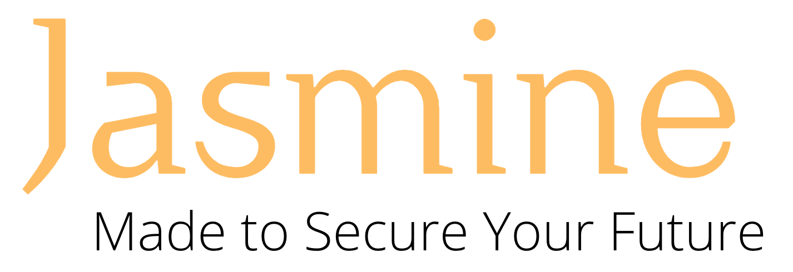

  
  
  

Jasmine is made to help you get into investing while making sure you avoid the noise. Don't be baited by the news about "popular" stocks/companies or potentially huge gains from betting on a company. Instead, Jasmine has two API endpoints which access BlackRock's Aladdin, which in turn, returns financial information that Jasmine uses to show users the advantages of diversification.

> Make sure that pipenv is installed on your system (look here <https://docs.python-guide.org/dev/virtualenvs/#virtualenvironments-ref):>

## Execution

- To look at the data run `python visual.py`

- To start the server run `./bootstrap.sh`

## Installation

1. Clone this repository to your local via git clone <hhttps://github.com/ssyuen/BRC.git>

2. cd into the cloned directory

3. `pipenv shell` will activate the virtual environment.

4. `pipenv install` will install the dependencies (i.e. requests.py and pandas)

5. Make sure when you are done with development, run `exit` to exit out of the virtual environment. This is important to make sure you will not have to delete and re-clone the repository.
